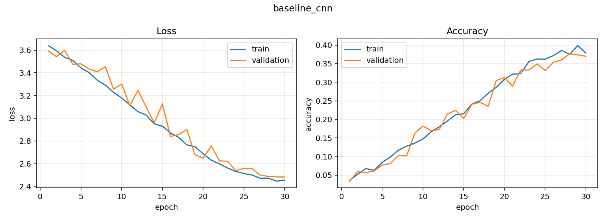

# Pet breed classifier — how much is ImageNet pretraining actually worth?

Fine-grained image classification over the 37 cat and dog breeds of the
**Oxford-IIIT Pet** dataset, in PyTorch.

The repository is built around one measurement. The same data, the same
augmentation, the same training budget are given to two models: a CNN trained
from scratch, and a ResNet-34 that starts from ImageNet weights. The gap
between them is the quantity of interest.

---

## Results

| Model | Pretrained | Params | Test top-1 | Test top-5 | Macro F1 | Train time (T4) |
|---|---|---|---|---|---|---|
| `SimpleCNN` (from scratch) | no | 1.18 M | 31.3 % | 70.1 % | 0.299 | 12.6 min (30 epochs) |
| `ResNet-34` (fine-tuned) | ImageNet | 21.3 M | **91.3 %** | **99.1 %** | **0.911** | **4.8 min** (12 epochs) |

**+60 points of top-1 accuracy, in less than half the training time.** The only
difference that matters here is where the weights started.

Top-5 accuracy of 99.1 % is the more revealing number: the fine-tuned model
almost never loses the right answer entirely. Its residual error is not spread
thinly over 37 classes, it is concentrated in a handful of breeds that are
genuinely hard to tell apart — see below.

<p align="center">
  
</p>

### Where the errors actually are

Six of the 37 breeds fall below 0.85 F1; seventeen are above 0.95. The failures
are not random:

| Breed | F1 | Confused with |
|---|---|---|
| American Pit Bull Terrier | 0.56 | Staffordshire Bull Terrier, American Bulldog |
| Staffordshire Bull Terrier | 0.66 | American Pit Bull Terrier, American Bulldog |
| Ragdoll | 0.78 | Birman |
| American Bulldog | 0.82 | Staffordshire Bull Terrier |

The three bull-type dogs form a visible block off the diagonal, and the
Ragdoll/Birman pair another. That is not a modelling defect to be tuned away:
these are breeds that differ by pedigree and registry as much as by appearance,
and a person without training would confuse them from the same photographs. The
model's errors are concentrated exactly where the label itself carries the least
visual information.

The baseline fails differently — American Pit Bull Terrier at 0.068 F1, Maine
Coon at 0.094 — not because those breeds are hard, but because it never learned
much of anything.

### The baseline underfits; it does not overfit

<p align="center">
  
</p>

Worth stating plainly, because the opposite is the usual expectation for a small
dataset. After 30 epochs the scratch CNN sits at **37.8 % training accuracy and
37.0 % validation accuracy** — the two curves are on top of each other. It is not
memorising the training set; it cannot fit it in the first place.

With ~160 images per breed, plus the augmentation, there is simply not enough
signal to learn general visual features (edges, textures, fur patterns) from a
random initialisation. The model is data-limited, not capacity-limited. That is
the whole argument for transfer learning stated as a measurement: the pretrained
network does not need to learn what a texture is, so its 5,880 images can go
entirely towards learning what distinguishes a Birman from a Ragdoll.

The fine-tuned ResNet, for its part, does overfit mildly — 99.9 % train against
93.9 % validation at the last epoch ([its curves](reports/resnet34/curves.png)).
Stronger regularisation or early stopping would close some of that; neither would
change the comparison.

### Grad-CAM — right answer, right reason?

<p align="center">
  
</p>

Accuracy says a model is right. It does not say *why*. Grad-CAM
([Selvaraju et al., 2017](https://arxiv.org/abs/1610.02391)) projects the
gradient of the predicted class back onto the last convolutional feature map, so
you can see which pixels moved the decision.

On most images the heat sits on the animal's face and coat, which is what you
want. On at least one it does not: an Abyssinian classified correctly at 28 %
confidence, with the heat sitting on a vase of flowers beside the cat. Right
answer, wrong reason — and the low confidence is the only thing that flags it.
This is the failure mode that accuracy on a test split cannot show you, and it is
why the implementation lives in [`src/gradcam.py`](src/gradcam.py), written from
the paper rather than imported.

---

## Method

**Data.** The official `trainval` split is cut 80/20 into train and validation
with a fixed seed (5,880 / 1,469 images). The official `test` split (3,669
images) is used exactly once, for the table above. Every hyperparameter decision
was made on validation, so the test number is an honest estimate rather than a
figure that has been optimised against.

**Augmentation.** Random resized crop, horizontal flip, mild colour jitter,
random erasing. No vertical flip: pets are photographed upright, so it would
teach the model a variation that never occurs at test time.

**Transfer learning, in two stages.** The order is deliberate:

1. **Frozen backbone, 3 epochs.** Only the new 37-way head trains. The head
   starts random, so its early gradients are large and noisy — letting them reach
   the pretrained features immediately would destroy exactly what we came for.
2. **Full fine-tuning, 9 epochs, learning rate ÷ 10.** With a sane head, the
   whole network adapts to pet breeds slowly enough not to wash out the ImageNet
   features.

Best validation accuracy arrived at epoch 10 of 12 — the schedule was about
right, with little left on the table.

**Other choices.** AdamW with cosine annealing; label smoothing at 0.1, which
consistently helps on fine-grained tasks where several classes are genuinely
confusable; mixed precision on GPU. Macro F1 is reported alongside accuracy so
that a model good only on the easy breeds cannot hide behind the mean — here the
two agree closely (0.911 vs 91.3 %), which says the errors are not concentrated
in a few starved classes.

---

## Repository layout

```
src/
  data.py        Dataset, splits, augmentation pipelines
  models.py      SimpleCNN baseline + ResNet factory with staged freezing
  train.py       Training loop: AMP, cosine schedule, checkpointing
  evaluate.py    Test metrics, confusion matrix, confident-mistake grid
  gradcam.py     Grad-CAM, implemented from the paper
  predict.py     Single-image inference from the command line
  utils.py       Seeding, device selection, curve plotting
notebooks/
  train_colab.ipynb   End-to-end run on a free Colab T4 (~20 min)
app/
  streamlit_app.py    Upload a photo, get top-5 + Grad-CAM
reports/         Figures and metrics from the runs above
```

## Reproducing

The fastest path is the notebook — open
[`notebooks/train_colab.ipynb`](notebooks/train_colab.ipynb) in Colab, set the
runtime to a T4 GPU, and run every cell. About 20 minutes end to end, including
the dataset download.

Locally:

```bash
pip install -r requirements.txt

# Baseline: no pretrained weights
python -m src.train --model simple_cnn --epochs 30 --freeze-epochs 0 --run-name baseline_cnn

# Transfer learning: frozen head, then full fine-tuning
python -m src.train --model resnet34 --epochs 12 --freeze-epochs 3 --run-name resnet34

# Test metrics and figures
python -m src.evaluate --checkpoint runs/resnet34/best.pt --out reports/resnet34

# One image
python -m src.predict --image photo.jpg --checkpoint runs/resnet34/best.pt
python -m src.gradcam --image photo.jpg --checkpoint runs/resnet34/best.pt --out cam.png

# Interactive demo
streamlit run app/streamlit_app.py
```

Seeds are fixed for Python, NumPy and torch. cuDNN kernel selection stays
nondeterministic, so a GPU rerun reproduces to within a few tenths of a point
rather than bit-for-bit.

---

## What this does not do

- **The softmax scores are not probabilities.** A model reporting 92 % is not
  right 92 % of the time. Temperature scaling on the validation split would fix
  the calibration; it is not implemented here, so the confidence shown in the
  demo should be read as a ranking, not a likelihood.
- **37 classes and nothing else.** Given a rabbit, the model still answers with a
  cat or a dog — softmax always sums to one. Real deployment needs an
  out-of-distribution check in front of it.
- **One backbone.** ResNet-34 against a scratch CNN separates "pretraining
  helps" from "no pretraining". It does not separate pretraining from
  architecture; that would need a modern backbone trained from scratch at a
  matched parameter budget.
- **The two models do not have matched capacity.** 21.3 M parameters against
  1.18 M. The underfitting evidence above argues the gap is about data rather
  than size, but a ResNet-34 trained from scratch would settle it directly.
- **No test-time augmentation, no ensembling.** Both would raise the number and
  neither would make the comparison more informative.

## Next steps

A ResNet-34 trained from scratch, to isolate architecture from pretraining;
temperature scaling for calibration; targeted work on the bull-terrier cluster,
where a third of the total error sits; ONNX export for a deployable demo.

---

## References

- Parkhi et al., *Cats and Dogs*, CVPR 2012 — the Oxford-IIIT Pet dataset.
- He et al., *Deep Residual Learning for Image Recognition*, CVPR 2016.
- Selvaraju et al., *Grad-CAM: Visual Explanations from Deep Networks via
  Gradient-based Localization*, ICCV 2017.

## License

MIT — see [LICENSE](LICENSE).

---

Built by **Amine Gaddas**, AI engineering student at EFREI Paris (T2IA major).
Looking for a 5-month computer vision / deep learning internship in the Paris
area, November 2026 – April 2027.
[LinkedIn](https://www.linkedin.com/in/amine-gaddas-855416388)
