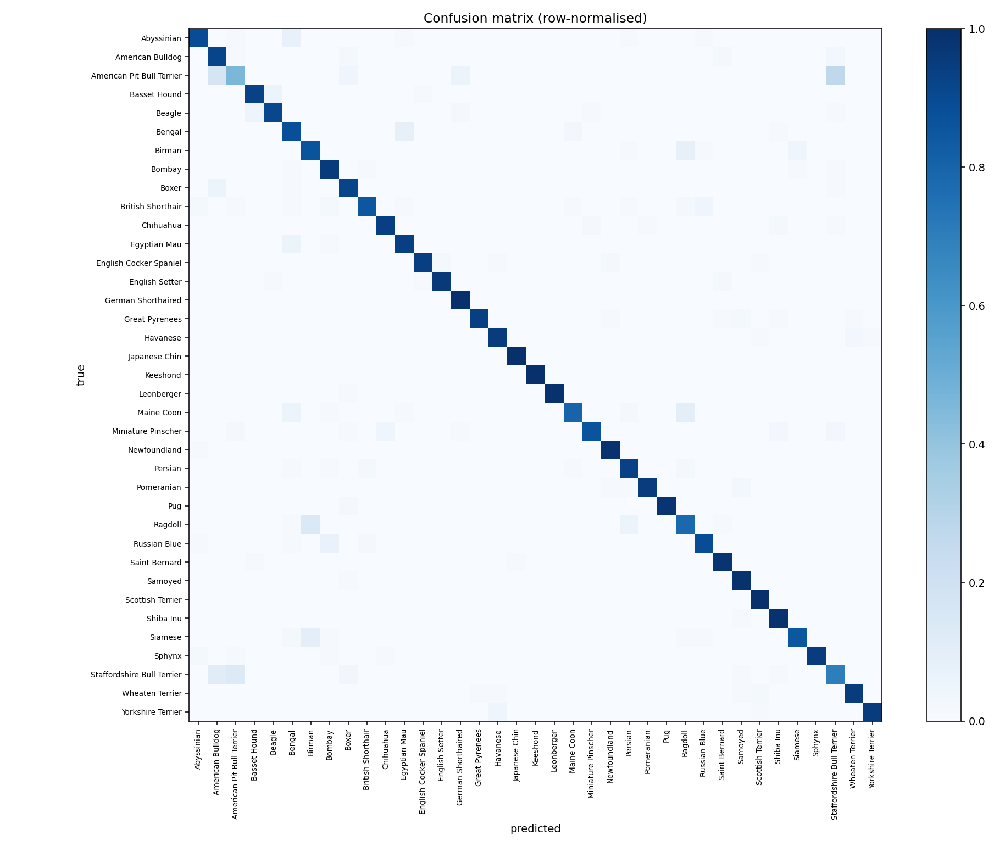
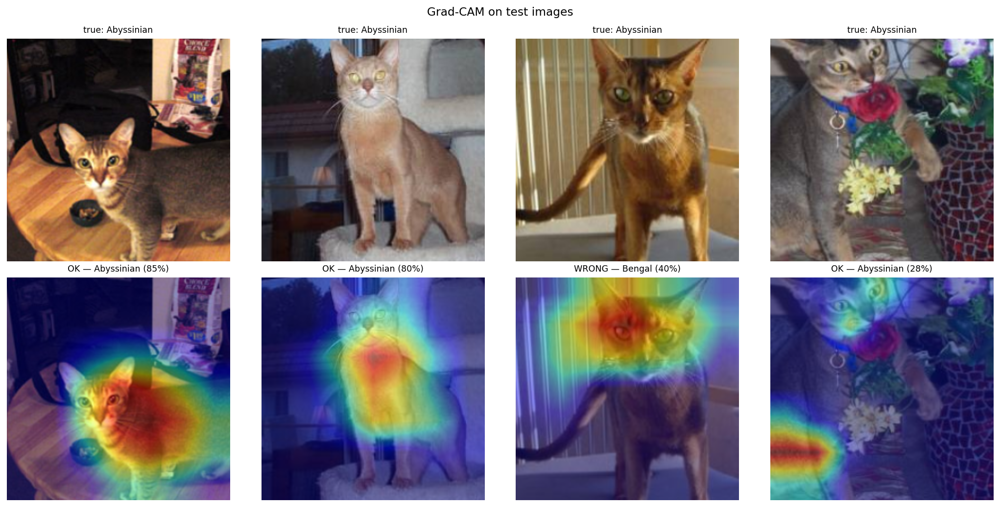

# Pet breed classifier — how much is ImageNet pretraining actually worth?

Fine-grained image classification over the 37 cat and dog breeds of the
**Oxford-IIIT Pet** dataset, in PyTorch.

The repository is built around one measurement. The same data, the same
augmentation, the same schedule length are given to two models: a CNN trained
from scratch, and a ResNet-34 that starts from ImageNet weights. The gap
between them is the quantity of interest.

> **Status:** code complete and tested; the numbers below come from the run in
> [`notebooks/train_colab.ipynb`](notebooks/train_colab.ipynb).
> <!-- RESULTS: replace every ⬜ below with the figures printed by the notebook, then delete this line. -->

---

## Results

| Model | Pretrained | Trainable params | Test top-1 | Test top-5 | Macro F1 | Train time (T4) |
|---|---|---|---|---|---|---|
| `SimpleCNN` (from scratch) | no | 1.18 M | ⬜ | ⬜ | ⬜ | ⬜ |
| `ResNet-34` (fine-tuned) | ImageNet | 21.3 M | ⬜ | ⬜ | ⬜ | ⬜ |

**The headline: ⬜ percentage points of top-1 accuracy, from nothing but the
initial weights.**

Both models see 5,880 training images — roughly 160 per breed. That is far too
few to learn general visual features from scratch, which is why the baseline
plateaus and overfits while the fine-tuned network does not. The comparison is
not "a big model beats a small one"; it is that on a dataset this size, *where
the weights start* dominates every other choice.

<p align="center">
  
</p>

The confusion matrix concentrates its errors where a human would make them too:
breeds that differ by coat texture rather than shape. The remaining mistakes are
worth reading one by one — `reports/*/confident_mistakes.png` shows the errors
the model was *most confident* about, which is where a dataset problem usually
shows up first.

### Grad-CAM — right answer, right reason?

<p align="center">
  
</p>

Accuracy says a model is right. It does not say *why*. Grad-CAM
([Selvaraju et al., 2017](https://arxiv.org/abs/1610.02391)) projects the
gradient of the predicted class back onto the last convolutional feature map,
so you can see which pixels moved the decision.

This matters because a classifier can reach a high score by reading the
background — grass, a sofa, a collar — if the dataset happens to correlate them
with a breed. That model looks excellent on the test split and fails on the
first photograph taken somewhere new. The implementation here is written from
the paper in [`src/gradcam.py`](src/gradcam.py) rather than imported, because
the mechanism is the point.

---

## Method

**Data.** The official `trainval` split is cut 80/20 into train and validation
with a fixed seed. The official `test` split is used exactly once, for the table
above. Every hyperparameter decision was made on validation, so the test number
is an honest estimate rather than a figure that has been optimised against.

**Augmentation.** Random resized crop, horizontal flip, mild colour jitter,
random erasing. No vertical flip: pets are photographed upright, so it would
teach the model a variation that never occurs at test time.

**Transfer learning, in two stages.** The order is deliberate:

1. **Frozen backbone, 3 epochs.** Only the new 37-way head trains. The head
   starts random, so its early gradients are large and noisy — letting them
   reach the pretrained features immediately would destroy exactly what we came
   for.
2. **Full fine-tuning, 9 epochs, learning rate ÷ 10.** With a sane head, the
   whole network adapts to pet breeds slowly enough not to wash out the
   ImageNet features.

Skipping stage 1 costs several points of accuracy and is the most common way to
get transfer learning wrong.

**Other choices.** AdamW with cosine annealing; label smoothing at 0.1, which
consistently helps on fine-grained tasks where several classes are genuinely
confusable; mixed precision on GPU. Macro F1 is reported alongside accuracy so
that a model which is good only on the easy breeds cannot hide behind the mean.

---

## Repository layout

```
src/
  data.py        Dataset, splits, augmentation pipelines
  models.py      SimpleCNN baseline + ResNet factory with staged freezing
  train.py       Training loop: AMP, cosine schedule, checkpointing
  evaluate.py    Test metrics, confusion matrix, confident-mistake grid
  gradcam.py     Grad-CAM, implemented from the paper
  predict.py     Single-image inference from the command line
  utils.py       Seeding, device selection, curve plotting
notebooks/
  train_colab.ipynb   End-to-end run on a free Colab T4 (~20 min)
app/
  streamlit_app.py    Upload a photo, get top-5 + Grad-CAM
reports/         Figures and metrics produced by the runs
```

## Reproducing

The fastest path is the notebook — open
[`notebooks/train_colab.ipynb`](notebooks/train_colab.ipynb) in Colab, set the
runtime to a T4 GPU, and run every cell. About 20 minutes end to end, including
the dataset download.

Locally:

```bash
pip install -r requirements.txt

# Baseline: no pretrained weights
python -m src.train --model simple_cnn --epochs 30 --freeze-epochs 0 --run-name baseline_cnn

# Transfer learning: frozen head, then full fine-tuning
python -m src.train --model resnet34 --epochs 12 --freeze-epochs 3 --run-name resnet34

# Test metrics and figures
python -m src.evaluate --checkpoint runs/resnet34/best.pt --out reports/resnet34

# One image
python -m src.predict --image photo.jpg --checkpoint runs/resnet34/best.pt
python -m src.gradcam --image photo.jpg --checkpoint runs/resnet34/best.pt --out cam.png

# Interactive demo
streamlit run app/streamlit_app.py
```

Seeds are fixed for Python, NumPy and torch. cuDNN kernel selection stays
nondeterministic, so a GPU rerun reproduces to within a few tenths of a point
rather than bit-for-bit.

---

## What this does not do

- **The softmax scores are not probabilities.** A model reporting 92 % is not
  right 92 % of the time. Temperature scaling on the validation split would fix
  the calibration; it is not implemented here, so the confidence shown in the
  demo should be read as a ranking, not a likelihood.
- **37 classes and nothing else.** Given a rabbit, the model still answers with
  a cat or a dog — softmax always sums to one. Real deployment needs an
  out-of-distribution check in front of it.
- **One backbone.** ResNet-34 against a scratch CNN separates "pretraining
  helps" from "no pretraining". It does not separate pretraining from
  architecture; that would need a modern backbone trained from scratch at a
  matched parameter budget.
- **No test-time augmentation, no ensembling.** Both would raise the number and
  neither would make the comparison more informative.

## Next steps

Class-balanced sampling for the breeds carrying most of the error; ConvNeXt-Tiny
at a matched budget; temperature scaling for calibration; ONNX export for a
deployable demo.

---

## References

- Parkhi et al., *Cats and Dogs*, CVPR 2012 — the Oxford-IIIT Pet dataset.
- He et al., *Deep Residual Learning for Image Recognition*, CVPR 2016.
- Selvaraju et al., *Grad-CAM: Visual Explanations from Deep Networks via
  Gradient-based Localization*, ICCV 2017.

## License

MIT — see [LICENSE](LICENSE).

---

Built by **Amine Gaddas**, AI engineering student at EFREI Paris (T2IA major).
Looking for a 5-month computer vision / deep learning internship in the Paris
area, November 2026 – April 2027.
[LinkedIn](https://www.linkedin.com/in/amine-gaddas-855416388)
